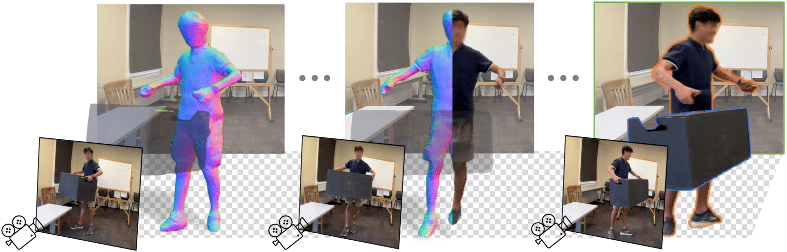

# Wild2Avatar: Rendering Humans Behind Occlusions

Paper: https://arxiv.org/pdf/2401.00431.pdf



## Dataset
We sampled **6 sequences** from the origianl [OcMotion](https://github.com/boycehbz/CHOMP) dataset to be used in our experiments. Each sequence has 100 frames with precomputed segmentation masks and ground truth SMPL parameters.  
The pre-proccesed sequences can be found [here](https://drive.google.com/drive/folders/1w9FzyKOhxQdhr_nmANRfRkXNdt9_M6BC?usp=sharing). Please follow the dataloader provided in [OccNeRF](https://github.com/tiangexiang/OccNeRF) to load the downloaded sequences.  
If you find the preprocessed sequences usefull, please consider to cite [CHOMP](https://arxiv.org/pdf/2207.05375).  

**TO BE UPDATED**

## Citation  

If you find this repo useful in your work or research, please cite:  

```
@article{xiang2023wild2avatar,
    title={Wild2Avatar: Rendering Humans Behind Occlusions},
    author={Tiange Xiang and Adam Sun and Scott Delp and Kazuki Kozuka and Li Fei-Fei and Ehsan Adeli},
    journal={arXiv},
    year={2023}
	}